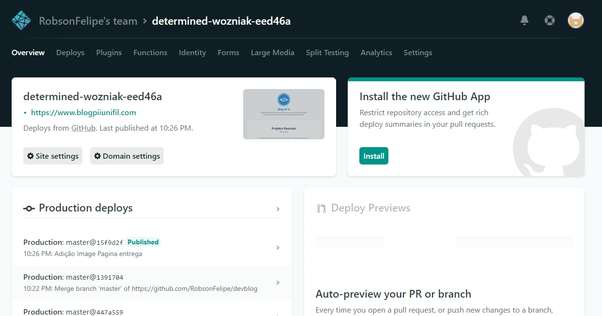
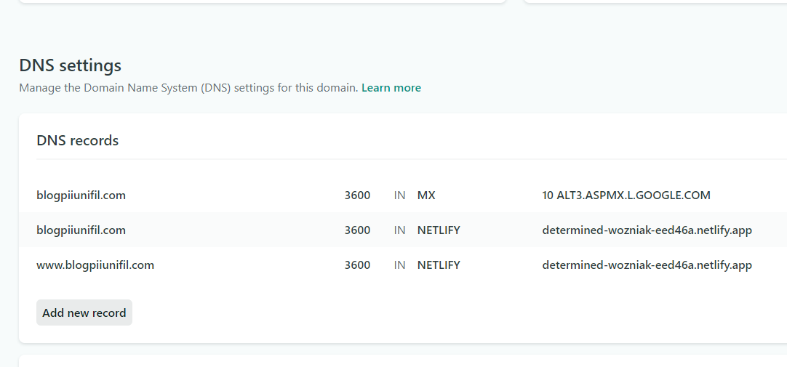

 
## PI-II - Registar o domínio, criar sessão de comentários e construir página <h2>

Neste post, trabalharemos e falaremos sobre a atividade a ser entregue no dia 31/05/2020 como trabalho na disciplina de Projeto Intediciplinar no curso de Ciência da Computação.

## Comprar um nome de domínio FQDN, configurar registros de DNS e apontar para o servidor lançado na etapa anterior. Sugestões: Namecheap ou GoDaddy. Sempre há nomes de domínio que custam $0,99/yr <h3>

Fizemos a locação do domínio www.blogpiiunifil.com pela plataforma Netlify. Com ela conseguimos deixar o site no ar por um ano, por uma taxa pequena.

A plataforma foi feita para trabalhar em conjunto com o Gatsby e tem toda sua configuração bem sofisticada para tratar de um serviço WEB. O que nos ajudou bastante.

## Configurar registro MX para encaminhar emails direcionados a webmaster@nomedodominiocomprado.xyz a um email pessoal qualquer <h3>

Fizemos o cadastro do DNS na plataforma Netlify porém não fizemos o cadastro do registro MX na plataforma Google Cloud Console, devido à questões monetárias.

## Construir página “Projetos pessoais” <h3>

Contruimos, e está acessível na página inicial, a página "Projetos Pessoais". Nela contamos um pouco sobre nossos projetos na faculdade e na vida, com o intuito de mostrar aos nossos visitantes o que a tecnologia e conhecimento podem proporcionar, mostrar que as coisas não são tão complicadas como aparentam ser.

## Colocar link no menu blog para repositório GitLab, GitHub ou Bitbucket <h3>

O link foi adicionado à nossa página principal e também pode ser encontrado em outras partes do site.

<cite> 30/05/2020 - Robson Souza <cite>