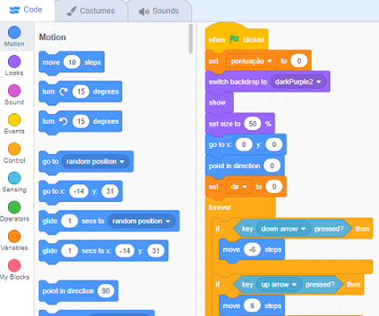
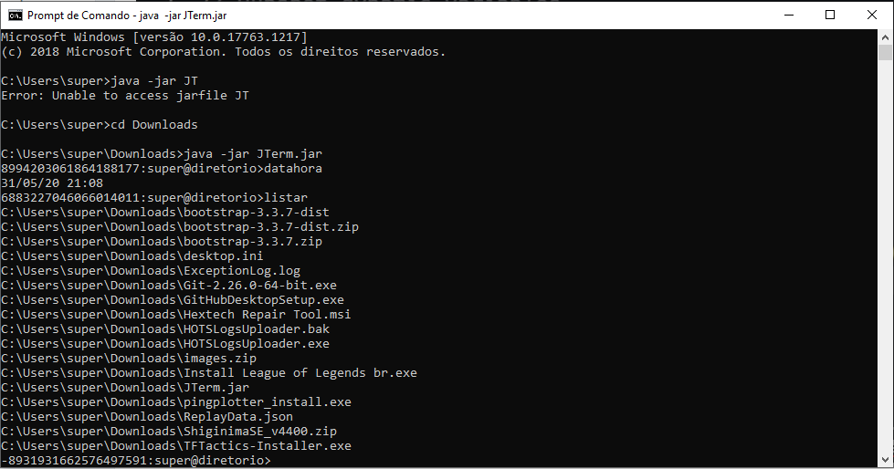
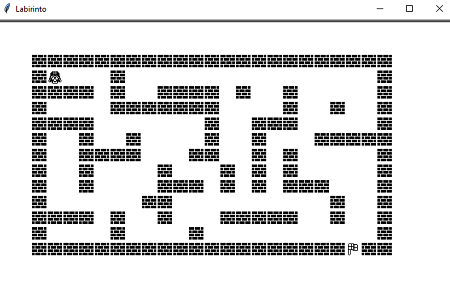
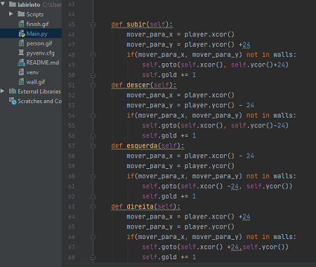

 
## Game Asteroid - Scratch <h2>

Este foi um jogo desenvolvido dentro de sala de aula, em uma matéria prática de desenvolvimento e prática de lógica de programação no primeiro ano do curso de Ciência da Computação.
O jogo tem a temática antiga de asteroids, tem a essência do game original com algumas mudanças simples.
Segue o link do jogo caso queira conferir o game em ação.

[Asteroid by Leonardo Lima](https://scratch.mit.edu/projects/105882236/)

Veja também, por dentor do game como a lógica funciona. É utilizado uma lógica simples de programação em blocos.

<cite> 12/05/2020 - Leonardo Lima <cite>

## Terminal Bash - JAVA <h2>

Projeto de desenvolvimento de um terminal bash, assim como o mais conhecido Prompt de Comando do Windows. 

Neste projeto, simulamos a execução de comandos simples para utilização de terminais de acesso, assim como no CMD, algumas funções simples foram aplicadas para entender a lógica destes terminais.

<cite> 17/05/2020 - Robson Souza <cite>

## Game Labirinto - Python <h2>

Um projeto também super interessante feito por nossos integrantes é o jogo labirinto, feito em Python. Ele consiste basicamente numa plataforma comum onde o usuário tem que chegar até a bandeira de chegada, passando por todo o percurso e atingir o menor número de passos para isso.

Este é o mapa do jogo.

Nele podemos, acessando as teclas de cima, baixo, direita e esquerda, caminhar pelo mapa condizindo personagem até o destino desejado.

Olha só como funciona, em Python, a configuração das teclas de movimentação do personagem.

<cite> 21/05/2020 - Pedro Rocha <cite>