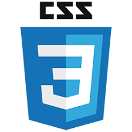

Bem vindo ao nosso blog da materia Projeto Interdisciplinar.

<!-- end -->

## Para desenvolvimento do projeto foi utilizado as seguintes tecnologias:

*   JS
*   HTML
*   CSS
*   Node.JS
*   Gatsby
*   Netlifyg

